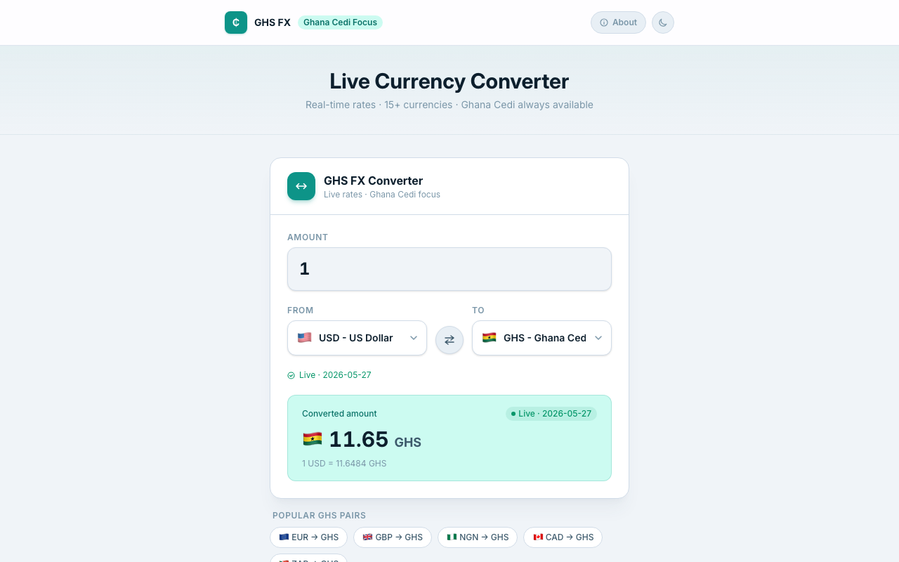

# GHS FX Converter

Real-time Ghana Cedi (GHS) currency converter — live rates, offline cache, zero backend.

**Live demo:** https://ghs-fx-converter.vercel.app  



## Supported Currencies

| Code | Currency |
|---|---|
| GHS | Ghana Cedi |
| USD | US Dollar |
| EUR | Euro |
| GBP | British Pound |
| NGN | Nigerian Naira |
| ZAR | South African Rand |
| CAD | Canadian Dollar |
| JPY | Japanese Yen |
| CNY | Chinese Yuan |
| AED | UAE Dirham |
| KES | Kenyan Shilling |
| EGP | Egyptian Pound |
| MAD | Moroccan Dirham |
| XOF | West African CFA Franc |
| TZS | Tanzanian Shilling |

## Features

- **Live rates** via primary + fallback API with automatic failover
- **1-hour localStorage cache** — works offline if previously loaded
- **Stale badge** when serving cached data, with the cache date
- **Debounced input** — no flicker on every keystroke
- **Swap button** — flip from/to in one click
- **Dark mode** toggle
- **Mobile-first** responsive layout

## How Rates Work

Rates are fetched from [fawazahmed0/exchange-api](https://github.com/fawazahmed0/exchange-api) — a free, keyless, 200+ currency API:

- **Primary:** `https://cdn.jsdelivr.net/npm/@fawazahmed0/currency-api@latest/v1/currencies/{base}.json`
- **Fallback:** `https://latest.currency-api.pages.dev/v1/currencies/{base}.json`

If the primary URL fails, the fallback is tried automatically. Responses are cached in localStorage for 1 hour. If both URLs fail and a cached entry exists, it is served with a "Cached" badge.

## Tech Stack

| Tool | Purpose |
|---|---|
| Vite 6 | Build tool & dev server |
| React 19 | UI framework |
| TypeScript | Type safety |
| Tailwind CSS v4 | Styling with custom design tokens |
| Vitest | Unit testing |

## Run Locally

```bash
npm install
npm run dev       # dev server → http://localhost:5173
npm run build     # production build
npm run preview   # preview production build
```

## Tests

```bash
npm run test
```

Covers: `convert()` (zero, large, rounding, invalid inputs), `formatMoney()` (USD, GHS, zero, large, unknown codes), `fetchRates()` (primary fetch + cache, fallback, stale cache, error), `getRate()`, and `isCacheStale()`. Fetch is mocked — no network calls in tests.

---

> **Estimate only.** Rates are provided as-is for reference. Always confirm with your bank or a licensed financial institution for transactions.

**Rate source credit:** [fawazahmed0/exchange-api](https://github.com/fawazahmed0/exchange-api)

## License

MIT
